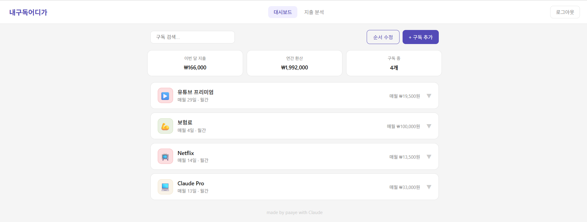
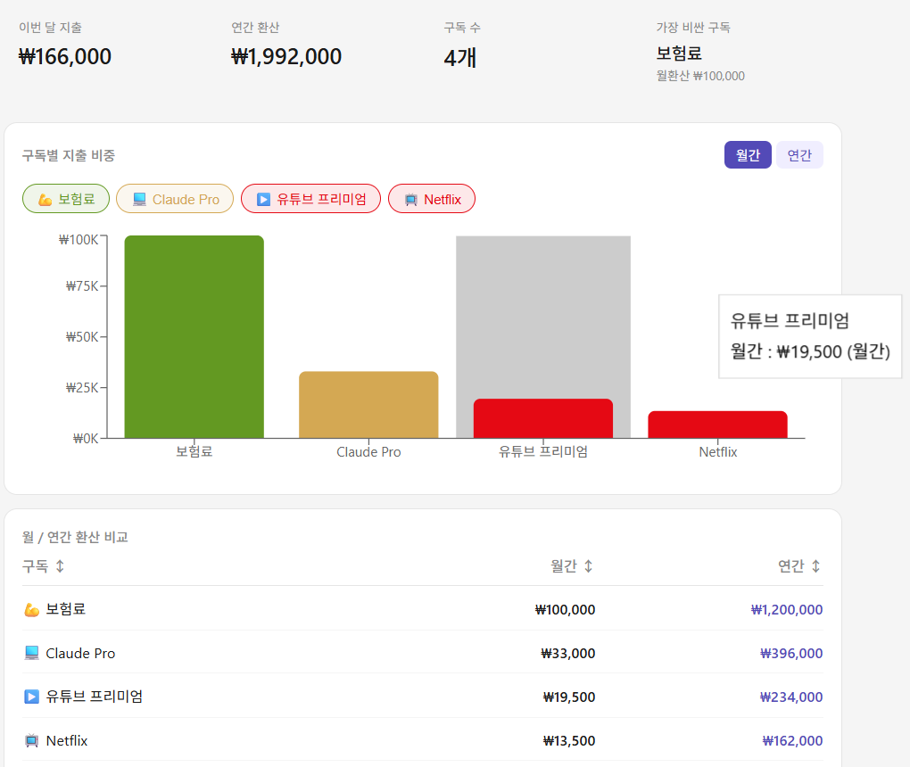
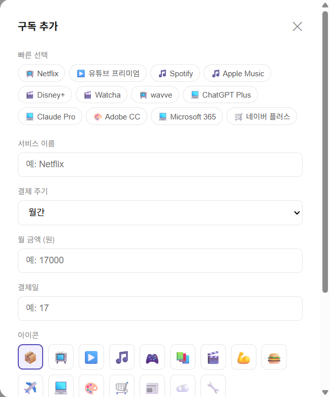
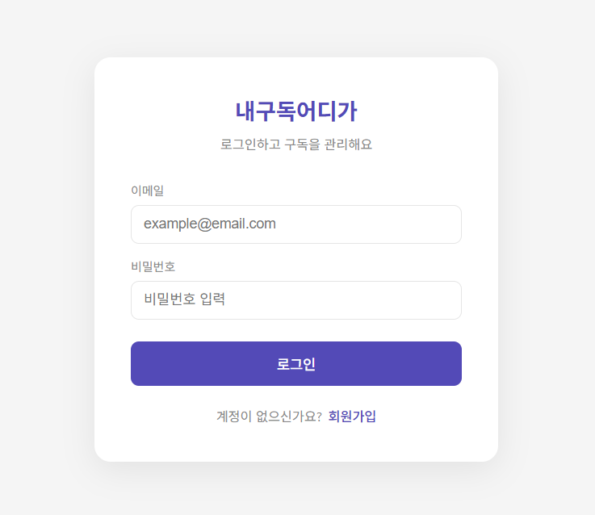

# 내구독어디가 (where-is-my-sub)

> 흩어진 구독 서비스를 한 곳에서 관리하고, 내 돈이 어디로 가는지 파악하는 구독 관리 웹 서비스

<p align="center">
  
  
  
  
  
  
  
</p>

<p align="center">
  <a href="https://where-is-my-sub.vercel.app/">🔗 서비스 바로가기</a>
</p>

---

## 📌 목차

1. [프로젝트 소개](#1-프로젝트-소개)
2. [프로젝트 미리보기](#2-프로젝트-미리보기)
3. [주요 기능](#3-주요-기능)
4. [기술 스택](#4-기술-스택)
5. [시스템 아키텍처](#5-시스템-아키텍처)
6. [프로젝트 구조](#6-프로젝트-구조)
7. [ERD](#7-erd)
8. [기능 상세](#8-기능-상세)
9. [기술적 고민 & 트러블슈팅](#9-기술적-고민--트러블슈팅)
10. [성능 개선](#10-성능-개선)
11. [주요 설계 결정](#11-주요-설계-결정)
12. [배운 점](#12-배운-점)
13. [향후 개선 계획](#13-향후-개선-계획)
14. [실행 방법](#14-실행-방법)

---

## 1. 프로젝트 소개

### 만든 이유

넷플릭스, 유튜브 프리미엄, Spotify, ChatGPT… 구독 서비스가 늘어날수록 매달 얼마가 나가는지 파악하기 어려워집니다. 카드 명세서를 뒤져도 언제 얼마가 빠지는지 한눈에 보이지 않고, 쓰지도 않는 구독을 계속 내고 있는 경우도 많습니다.

**내구독어디가**는 구독 서비스를 직접 등록하고, 월간/연간 지출을 시각적으로 파악할 수 있는 개인 구독 관리 서비스입니다.

### 핵심 기능

| 기능 | 설명 |
|------|------|
| 📋 구독 관리 | 구독 등록·수정·삭제·검색, 드래그 앤 드롭으로 순서 변경 |
| 📊 지출 분석 | 월간/연간 지출 비중 바 차트, 구독별 비교 테이블 |
| 🔐 회원 인증 | JWT 기반 회원가입/로그인, 계정별 데이터 분리 |

---

## 2. 프로젝트 미리보기

### 대시보드


### 지출 분석


### 구독 추가 모달


### 로그인


**🔗 배포 주소**: https://where-is-my-sub.vercel.app/

---

## 3. 주요 기능

### 대시보드

- 구독 카드 등록 / 수정 / 삭제 / 검색
- 구독 카드 클릭 시 수정·삭제 버튼 노출 (모바일 탭-투-확장 UX)
- 드래그 앤 드롭으로 순서 변경 (PC 마우스 + 모바일 터치 모두 지원)
- 순서 수정 모드: 이름순 / 금액순 / 결제일순 자동 정렬 후 저장
- 상단 요약 카드: 이번 달 지출 / 연간 환산 / 구독 수
- 월간·연간 구독 구분 표시 (연간 구독은 결제월·일 + 월환산 금액 병기)

### 지출 분석

- 구독별 지출 비중 바 차트 (월간 / 연간 토글)
- 차트 색상이 구독 카드 색상과 동일하게 반영
- 필터 토글 버튼으로 특정 구독을 차트에서 제외/포함 (버튼은 항상 유지)
- 이름 / 월간 / 연간 기준 오름차순·내림차순 정렬 가능한 비교 테이블
- 정렬 기준이 차트와 필터 버튼 순서에도 동일하게 연동
- 가장 비싼 구독 강조 표시 (월환산 기준)
- 반응형 레이아웃 (4열 → 3열 → 2열)

### 구독 추가/수정 모달

- 빠른 선택 템플릿 12종 (Netflix, 유튜브 프리미엄, Spotify, Apple Music, Disney+, Watcha, wavve, ChatGPT Plus, Claude Pro, Adobe CC, Microsoft 365, 네이버 플러스)
- 이모지 아이콘 16종 선택
- 색상 팔레트 16가지 선택 (템플릿 색상과 통일)
- 월간 / 연간 결제 주기 선택, 연간 선택 시 결제월 입력 필드 추가 노출

### 인증

- 이메일 / 비밀번호 회원가입 및 로그인
- JWT 토큰 발급 (유효기간 7일), localStorage 저장
- axios interceptor로 모든 API 요청에 토큰 자동 첨부

---

## 4. 기술 스택

### Frontend

| 기술 | 버전 | 선택 이유 |
|------|------|-----------|
| React | ^19.2.5 | 컴포넌트 기반 UI 구성, 상태 관리 용이 |
| Vite | ^8.0.10 | CRA 대비 빠른 HMR과 빌드 속도 |
| axios | ^1.15.2 | interceptor를 통한 JWT 자동 첨부 처리 |
| @dnd-kit/core, @dnd-kit/sortable | ^6.3.1 / ^10.0.0 | PointerSensor + TouchSensor 동시 지원으로 PC·모바일 드래그 모두 대응. react-beautiful-dnd는 모바일 터치를 공식 지원하지 않아 제외 |
| recharts | ^3.8.1 | React 컴포넌트 방식으로 구독 색상을 차트에 직접 반영하기 용이 |

### Backend

| 기술 | 버전 | 선택 이유 |
|------|------|-----------|
| Node.js + Express | ^5.2.1 | 경량 RESTful API 서버 구성에 적합, JavaScript로 프론트와 언어 통일 |
| jsonwebtoken | ^9.0.3 | Stateless 인증 구현, 별도 세션 스토어 불필요 |
| bcrypt | ^6.0.0 | 비밀번호 단방향 해싱, 평문 저장 방지 |
| pg | ^8.20.0 | Node.js에서 PostgreSQL 연결을 위한 표준 라이브러리 |

### Database

| 기술 | 선택 이유 |
|------|-----------|
| PostgreSQL | 구독-유저 간 외래 키(ON DELETE CASCADE) 등 관계형 데이터 구조에 적합 |

### 배포 인프라

| 서비스 | 용도 | 선택 이유 |
|--------|------|-----------|
| Vercel | 프론트엔드 배포 | GitHub 연동 자동 배포, React/Vite 프로젝트에 최적화 |
| Render | 백엔드 + PostgreSQL 배포 | 무료 티어에서 Node.js 서버와 PostgreSQL을 함께 운영 가능 |

---

## 5. 시스템 아키텍처

```
┌─────────────────────────────────────────────────────────┐
│                        Client                           │
│              Browser (React + Vite)                     │
│                  Vercel 배포                             │
└───────────────────────┬─────────────────────────────────┘
                        │ HTTPS (REST API)
                        │ Authorization: Bearer {JWT}
┌───────────────────────▼─────────────────────────────────┐
│                    API Server                           │
│              Node.js + Express                          │
│                  Render 배포                             │
│                                                         │
│  ┌─────────────┐  ┌──────────────┐  ┌───────────────┐  │
│  │ /api/auth   │  │/api/subscript│  │  authMiddle-  │  │
│  │  register   │  │  ions        │  │  ware (JWT    │  │
│  │  login      │  │  CRUD +      │  │  검증)        │  │
│  └─────────────┘  │  reorder     │  └───────────────┘  │
│                   └──────────────┘                      │
└───────────────────────┬─────────────────────────────────┘
                        │ pg (node-postgres)
┌───────────────────────▼─────────────────────────────────┐
│                    Database                             │
│                  PostgreSQL                             │
│                  Render 배포                             │
│                                                         │
│   users                  subscriptions                  │
│   ─────────────          ──────────────────────────     │
│   id (PK)                id (PK)                        │
│   email                  user_id (FK → users.id)        │
│   password               name, price, cycle ...         │
└─────────────────────────────────────────────────────────┘
```

**배포 흐름**: GitHub main 브랜치에 push → Vercel(프론트), Render(백엔드) 자동 배포

---

## 6. 프로젝트 구조

```
where-is-my-sub/
├── src/                          # 프론트엔드 (React)
│   ├── components/
│   │   ├── Header.jsx            # 상단 네비게이션, 로그아웃 버튼
│   │   ├── SubCard.jsx           # 구독 카드 (클릭 시 수정/삭제 버튼 노출)
│   │   ├── SummaryBox.jsx        # 이번 달 지출 / 연간 환산 / 구독 수 요약 카드
│   │   └── AddSubModal.jsx       # 구독 추가/수정 모달 (템플릿, 아이콘, 색상 선택)
│   ├── pages/
│   │   ├── Dashboard.jsx         # 메인 대시보드 (dnd-kit 드래그 앤 드롭, 순서 수정 모드)
│   │   ├── AnalyticsPage.jsx     # 지출 분석 (recharts 바 차트, 필터, 비교 테이블)
│   │   └── AuthPage.jsx          # 회원가입 / 로그인 폼
│   ├── api.js                    # axios 인스턴스 + JWT interceptor + API 함수 모음
│   ├── App.jsx                   # 라우팅, 인증 상태 관리, ServerWakeup 배너 통합
│   ├── main.jsx                  # React 앱 진입점
│   └── index.css                 # 전역 스타일
│
└── server/                       # 백엔드 (Node.js + Express)
    ├── routes/
    │   ├── auth.js               # POST /auth/register, POST /auth/login
    │   └── subscriptions.js      # GET·POST·PUT·DELETE /subscriptions (+ /reorder)
    ├── middleware/
    │   └── auth.js               # JWT 검증 미들웨어 (authMiddleware)
    ├── index.js                  # Express 서버 진입점, CORS 설정, 라우터 연결
    ├── db.js                     # PostgreSQL 연결 (DB_URL 우선, 없으면 개별 환경변수)
    └── .env                      # 백엔드 환경변수 (DB 접속 정보, JWT_SECRET)
```

---

## 7. ERD

```
┌──────────────────────────┐         ┌─────────────────────────────────────┐
│          users           │         │            subscriptions            │
├──────────────────────────┤         ├─────────────────────────────────────┤
│ id          SERIAL  (PK) │ 1     N │ id            SERIAL  (PK)          │
│ email       VARCHAR      │─────────│ user_id       INTEGER (FK)          │
│ password    VARCHAR      │         │ name          VARCHAR                │
│ created_at  TIMESTAMP    │         │ price         INTEGER                │
└──────────────────────────┘         │ billing_date  INTEGER                │
                                     │ billing_month INTEGER  (연간만 사용) │
                                     │ cycle         VARCHAR  (monthly/     │
                                     │                         yearly)      │
                                     │ order_index   INTEGER  (정렬 순서)   │
                                     │ icon          VARCHAR  (이모지)      │
                                     │ color         VARCHAR  (hex 컬러)    │
                                     │ created_at    TIMESTAMP              │
                                     └─────────────────────────────────────┘
```

- `users.id` → `subscriptions.user_id` **1:N 관계**
- `ON DELETE CASCADE`: 유저 삭제 시 해당 유저의 구독 데이터 전체 자동 삭제
- `billing_month`: 연간 구독(`cycle = 'yearly'`)일 때만 사용, 월간 구독은 `NULL`
- `order_index`: 드래그 앤 드롭으로 변경한 순서를 DB에 영구 저장하기 위한 컬럼

---

## 8. 기능 상세

### 8-1. 드래그 앤 드롭 순서 변경

**동작 방식**

1. `@dnd-kit/core`의 `DndContext`로 드래그 컨텍스트를 구성하고, `SortableContext`로 구독 카드 목록을 감쌈
2. 드래그 종료(`onDragEnd`) 시 `arrayMove`로 로컬 state를 즉시 업데이트 → 사용자는 지연 없이 변경된 순서를 확인
3. 이후 `reorderSubscriptions(newOrder.map(s => s.id))` API 호출로 변경된 순서를 서버에 저장
4. 서버는 `PUT /subscriptions/reorder`에서 전달받은 `orderedIds` 배열 순서대로 각 구독의 `order_index`를 업데이트

**PC + 모바일 동시 지원**

```js
// Dashboard.jsx
const sensors = useSensors(
  useSensor(PointerSensor),   // PC 마우스
  useSensor(TouchSensor, {    // 모바일 터치
    activationConstraint: {
      delay: 500,             // 500ms 길게 누르면 드래그 시작
      tolerance: 8,           // 8px 이내 움직임은 스크롤로 허용
    },
  })
);
```

```jsx
// SubCard.jsx — 드래그 핸들에 touchAction: 'none' 적용
// 브라우저 기본 스크롤과 드래그 이벤트 충돌 방지
<div style={{ touchAction: 'none' }} {...listeners}>
  ⠿
</div>
```

**고려한 점**
- `react-beautiful-dnd`는 모바일 터치를 공식 지원하지 않아 `@dnd-kit`으로 선택
- `delay: 500`은 스크롤과 드래그를 구분하기 위한 임계값. 너무 짧으면 스크롤 시에도 드래그가 활성화됨
- 로컬 state를 먼저 업데이트(낙관적 업데이트)하고 서버 요청을 후속으로 보내 체감 반응속도를 높임

---

### 8-2. 연간 구독 월환산 계산

**동작 방식**

연간 구독(`cycle === 'yearly'`)은 실제 결제 금액(`price`)을 12로 나눈 값을 월환산 금액으로 사용한다. 이 값이 요약 카드의 "이번 달 지출"과 지출 분석 차트의 기준이 된다.

```js
// SummaryBox.jsx, AnalyticsPage.jsx 공통 로직
const monthly = cycle === 'yearly' ? price / 12 : price;
```

**고려한 점**
- 연간 구독을 월환산하지 않으면 요약 카드의 "이번 달 지출"이 실제 부담과 달라짐
- 지출 분석 페이지의 월간/연간 토글: 월간 탭은 `price / 12`, 연간 탭은 `price` 그대로 사용

---

### 8-3. 서버 웨이크업 배너

**배경**

Render 무료 티어는 15분간 요청이 없으면 서버가 슬립 상태에 진입한다. 이후 첫 요청 시 cold start가 발생해 응답이 수십 초 지연되거나 실패한다. 아무 피드백 없이 로딩이 길어지면 사용자는 서비스가 고장난 것으로 인식한다.

**동작 방식**

```
앱 진입
  │
  ▼
GET /health 요청
  │
  ├─ 2초 이내 응답 → 배너 미노출 (정상)
  │
  └─ 2초 초과 → 상단 배너 노출 "서버를 깨우는 중..."
                  │
                  ├─ 응답 성공 → "서버가 준비됐어요!" (초록) → 2초 후 자동 숨김
                  │
                  └─ 응답 실패 → "서버 연결에 실패했어요" 배너 유지
```

- `GET /health` 전용 엔드포인트를 두어 DB 쿼리 없이 서버 생존 여부만 확인
- 전체 화면 오버레이 대신 상단 배너 방식 → 사용자가 UI를 탐색하면서 대기 가능
- 로그인 실패 에러 메시지가 cold start 중 연결 거부로 인해 뜨는 문제도 배너로 대체 처리

---

## 9. 기술적 고민 & 트러블슈팅

### 🐛 1. 모바일에서 드래그 앤 드롭이 전혀 동작하지 않음

**Problem**

PC에서는 구독 카드 드래그가 정상 동작하는데, 모바일 브라우저에서는 길게 눌러도 전혀 반응이 없었다.

**Cause**

`@dnd-kit`의 `PointerSensor`만 등록되어 있어 터치 이벤트를 수신하지 못했다. 또한 브라우저 기본 스크롤 동작과 드래그 이벤트가 동일한 터치 입력을 두고 충돌했다.

**Solution**

1. `TouchSensor`를 추가 등록하고 `activationConstraint`로 500ms 딜레이를 설정해 스크롤과 드래그를 구분
2. 드래그 핸들 요소에 `touchAction: 'none'` 스타일을 적용해 브라우저가 해당 터치 이벤트를 스크롤에 사용하지 못하도록 차단

```js
useSensor(TouchSensor, {
  activationConstraint: { delay: 500, tolerance: 8 },
})
```

**Result**

모바일에서도 드래그 핸들을 길게 누르면 카드가 들려 순서 변경이 가능해졌다.

**Learned**

모바일 터치 이벤트는 PC와 별도로 고려해야 한다. 브라우저의 기본 제스처(스크롤, 줌)와 커스텀 인터랙션이 동일한 이벤트를 공유하기 때문에, `touchAction` CSS 속성으로 브라우저 기본 동작을 명시적으로 제어해야 한다.

---

### 🐛 2. 드래그로 순서를 바꿔도 새로고침하면 원래대로 돌아옴

**Problem**

대시보드에서 드래그로 구독 카드 순서를 변경한 뒤 페이지를 새로고침하면 변경 전 순서로 복원되었다.

**Cause**

백엔드 `subscriptions.js`에서 라우트 선언 순서 문제였다. `PUT /subscriptions/reorder`가 `PUT /subscriptions/:id` 아래에 선언되어 있어, Express가 `"reorder"` 문자열을 `:id` 파라미터로 인식해버렸다. 즉 순서 저장 요청이 실제로는 id가 `"reorder"`인 구독 수정 요청으로 처리되어 아무 데이터도 바뀌지 않았다.

**Solution**

`/reorder` 라우트를 `/:id` 라우트보다 **위에** 선언했다.

```js
// 수정 전 (버그)
router.put('/:id', ...)      // ← "reorder"가 여기에 매칭됨
router.put('/reorder', ...)  // ← 여기엔 절대 도달 못함

// 수정 후 (정상)
router.put('/reorder', ...)  // ← 먼저 선언
router.put('/:id', ...)
```

**Result**

새로고침 후에도 변경된 순서가 유지되었다.

**Learned**

Express는 라우트를 **선언 순서대로** 매칭한다. 정적 경로(`/reorder`)와 동적 경로(`/:id`)가 공존할 때는 반드시 정적 경로를 먼저 선언해야 한다. 라우팅 버그는 에러 메시지가 없어 원인을 찾기 어려우므로, API 응답 로그를 확인하는 습관이 중요하다.

---

### 🐛 3. 수정 모달을 열면 결제일·결제월 값이 비어 있음

**Problem**

구독 카드의 수정 버튼을 눌러 모달을 열면 서비스명·금액은 채워지는데, 결제일과 결제월 입력 필드가 항상 비어 있었다.

**Cause**

네이밍 컨벤션 불일치가 원인이었다. `SubCard.jsx`에서 `onEdit`으로 넘기는 데이터는 카멜케이스(`billingDate`, `billingMonth`)인데, `AddSubModal.jsx`에서는 DB 원본 필드명인 스네이크케이스(`billing_date`, `billing_month`)로 읽으려 해서 값이 `undefined`가 되었다.

```js
// SubCard.jsx — 카멜케이스로 전달
onEdit({ id, name, price, billingDate, billingMonth, cycle, icon, color })

// AddSubModal.jsx — 스네이크케이스로 읽으려 함 → undefined
defaultValue={editData?.billing_date}  // ❌
```

**Solution**

모달에서 값을 읽을 때 양쪽 케이스를 모두 체크하는 방식으로 처리했다.

```js
defaultValue={editData?.billingDate ?? editData?.billing_date}  // ✅
```

**Result**

수정 모달을 열면 기존 결제일·결제월 값이 정상적으로 채워졌다.

**Learned**

DB 컬럼명(스네이크케이스)과 프론트 컴포넌트 간 전달 데이터(카멜케이스)가 혼용되면 조용한 버그가 발생한다. 프로젝트 전체에서 명명 규칙을 통일하거나, API 응답 레벨에서 일괄 변환하는 레이어를 두는 것이 근본적인 해결책이다.

---

### 🐛 4. 어느 날 갑자기 로그인 500 에러, 구독 조회 401 에러

**Problem**

배포된 서비스에 접속하니 로그인 시 500 에러, 구독 목록 조회 시 401 에러가 발생했다. 코드를 변경한 적이 없었다.

**Cause**

Render 무료 PostgreSQL 플랜은 **90일이 지나면 DB를 자동 삭제**한다. Render 대시보드를 확인하니 DB 인스턴스 자체가 사라져 있었다.

**Solution**

1. Render 대시보드에서 동일한 이름으로 PostgreSQL DB 재생성
2. 새로 발급된 Internal Database URL을 Render 서버 환경변수 `DB_URL`에 갱신
3. `users`, `subscriptions` 테이블 스키마 전체 재실행
4. 기존 계정과 데이터는 모두 유실 → 재가입 필요

**Result**

서비스가 정상 복구되었다. 이후 90일 주기를 캘린더에 등록해 만료 전 대응할 수 있도록 했다.

**Learned**

무료 인프라는 운영 제약이 명확하다. Render 무료 PostgreSQL의 90일 자동 삭제, 서버 15분 슬립 모드 등은 서비스 기획 단계부터 인지하고 대응 방안을 마련해야 한다. 사용자 데이터가 쌓이기 전에 유료 플랜 전환 또는 대체 플랫폼으로 마이그레이션을 검토해야 한다.

---

## 10. 성능 개선

### Render 콜드 스타트 UX 개선

| 항목 | 개선 전 | 개선 후 |
|------|---------|---------|
| cold start 시 사용자 피드백 | 없음 (로그인 버튼이 그냥 안 됨) | 상단 배너 "서버를 깨우는 중..." 노출 |
| 연결 실패 메시지 | "로그인에 실패했습니다" (원인 불명) | 배너가 대신 안내, 로그인 에러 메시지 억제 |
| 서버 복구 후 처리 | 없음 | "서버가 준비됐어요!" → 2초 후 자동 숨김 |

`GET /health` 엔드포인트는 DB 쿼리 없이 `{ status: 'ok' }` 만 반환하도록 설계해 서버 부하 없이 생존 여부만 확인한다.

### 드래그 낙관적 업데이트

드래그 종료 시 서버 응답을 기다리지 않고 로컬 state를 먼저 업데이트한 뒤 서버에 저장 요청을 보낸다. 사용자는 네트워크 지연과 무관하게 즉각적인 시각 피드백을 받는다.

---

## 11. 주요 설계 결정

### 별도 상태 관리 라이브러리 미사용

Redux, Zustand 등을 도입하지 않고 React의 `useState`만 사용했다. 현재 규모에서는 전역 상태가 사실상 없고, 상태 대부분이 `Dashboard.jsx` 한 곳에서 관리된다. 오버 엔지니어링을 피하고 코드 복잡도를 낮추는 선택이었다.

### 모달 상태를 Dashboard 한 곳에서 관리

초기에는 `App.jsx`에서 `showModal` 상태를 관리하고 `Header`와 `Dashboard` 양쪽으로 내려줬다. 이로 인해 리렌더링 시 상태가 꼬여 모달이 열리지 않는 버그가 발생했다. 이후 모달 상태와 구독 데이터를 모두 `Dashboard.jsx` 단일 컴포넌트에서 관리하도록 구조를 변경했다. **상태는 그것을 실제로 사용하는 컴포넌트에 최대한 가깝게 두는 것이 원칙**이다.

### DB 스키마 변경 시 로컬·Render 동시 적용 원칙

`icon`, `color` 컬럼을 Render DB에만 추가하고 로컬 DB에는 빠뜨린 적이 있었다. 로컬에서 구독 추가 시 500 에러가 발생했고, 원인을 찾는 데 시간이 걸렸다. 이후 스키마 변경은 반드시 로컬과 Render 둘 다 동일하게 적용하는 것을 원칙으로 삼았다.

### JWT Stateless 인증

서버에 세션을 저장하지 않는 JWT 방식을 선택했다. Render 무료 서버는 슬립 후 재시작 시 인메모리 세션이 초기화되는 문제가 있어 Stateless 방식이 이 환경에 더 적합하다.

---

## 12. 배운 점

### 무료 인프라의 현실적인 제약을 이해하게 됐다

Render 무료 티어를 운영하면서 이론으로만 알던 문제들을 직접 경험했다. 15분 비활성 시 슬립 모드, 90일 DB 자동 삭제, cold start 지연은 모두 실제 사용자에게 영향을 주는 문제였다. 서비스를 기획할 때부터 인프라 제약을 고려하고 그에 맞는 UX 대응(서버 웨이크업 배너)을 함께 설계하는 경험을 할 수 있었다.

### 모바일 UX는 별도로 설계해야 한다

PC에서 완벽하게 동작하는 드래그 앤 드롭이 모바일에서는 전혀 동작하지 않았다. 터치 이벤트, 브라우저 기본 제스처와의 충돌, `touchAction` CSS 속성까지, 모바일 인터랙션은 PC와 별도의 레이어에서 고려해야 한다는 것을 실감했다.

### 상태는 사용하는 곳에 가깝게 두어야 한다

`App.jsx`에서 모달 상태를 관리하다 리렌더링 버그를 겪었다. 이후 상태를 실제로 사용하는 `Dashboard.jsx`로 내린 뒤 버그가 해결됐다. 전역 상태 관리 도구를 쓰지 않더라도, 상태의 소유권을 명확히 하는 것이 먼저라는 점을 배웠다.

### Express 라우팅은 선언 순서가 동작을 결정한다

`/reorder`가 `/:id`로 매칭되는 버그를 겪으면서, Express가 라우트를 선언 순서대로 평가한다는 것을 명확히 이해했다. 정적 경로는 동적 경로보다 반드시 먼저 선언해야 한다.

### 네이밍 컨벤션 불일치는 조용한 버그를 만든다

DB 스네이크케이스와 프론트 카멜케이스가 혼용되면서 에러 메시지 없이 값만 빠지는 버그가 발생했다. 프로젝트 초기에 데이터 흐름 전체에 걸친 네이밍 규칙을 통일하거나, API 응답 레벨에서 변환 레이어를 두는 것이 중요하다는 것을 깨달았다.

---

## 13. 향후 개선 계획

### 인프라 안정성

- [ ] Render 무료 PostgreSQL 90일 만료 이슈 근본 대응 — 유료 플랜 전환 또는 Supabase, Railway 등 대체 플랫폼 검토
- [ ] Render 슬립 모드 대응 — 유료 전환 또는 외부 cron 서비스로 주기적 헬스체크 요청

### 기능 확장

- [ ] 랜딩 페이지 제작 — 서비스 소개 및 Google AdSense 적용을 위한 공개 페이지
- [ ] 결제일 알림 — 결제 예정일 N일 전 이메일 또는 브라우저 알림

### 코드 품질

- [ ] API 응답 레벨에서 스네이크케이스 → 카멜케이스 일괄 변환 레이어 추가
- [ ] 환경변수 `JWT_SECRET` 예시값(`REDACTED_JWT_SECRET`) → 실제 랜덤 시크릿으로 교체

---

## 14. 실행 방법

### 사전 조건

- Node.js 18 이상
- PostgreSQL 설치 및 실행 중

### 1. 저장소 클론

```bash
git clone https://github.com/paaye7313/where-is-my-sub.git
cd where-is-my-sub
```

### 2. 프론트엔드 환경변수 설정

프로젝트 루트에 `.env.local` 파일 생성:

```
VITE_API_URL=http://localhost:3001/api
```

### 3. 백엔드 환경변수 설정

`server/.env` 파일 생성:

```
DB_USER=postgres
DB_PASSWORD=your_password
DB_HOST=localhost
DB_PORT=5432
DB_NAME=whereismysub
JWT_SECRET=your_secret_key
```

### 4. DB 초기화

```sql
CREATE DATABASE whereismysub;

\c whereismysub

CREATE TABLE users (
  id SERIAL PRIMARY KEY,
  email VARCHAR(255) UNIQUE NOT NULL,
  password VARCHAR(255) NOT NULL,
  created_at TIMESTAMP DEFAULT CURRENT_TIMESTAMP
);

CREATE TABLE subscriptions (
  id SERIAL PRIMARY KEY,
  user_id INTEGER REFERENCES users(id) ON DELETE CASCADE,
  name VARCHAR(255) NOT NULL,
  price INTEGER NOT NULL,
  billing_date INTEGER NOT NULL,
  billing_month INTEGER DEFAULT NULL,
  cycle VARCHAR(50) NOT NULL,
  order_index INTEGER DEFAULT 0,
  icon VARCHAR(10) DEFAULT '📦',
  color VARCHAR(20) DEFAULT '#534AB7',
  created_at TIMESTAMP DEFAULT CURRENT_TIMESTAMP
);
```

### 5. 의존성 설치 및 실행

터미널 두 개를 열어 각각 실행한다.

**터미널 1 — 프론트엔드**

```bash
cd where-is-my-sub
npm install
npm run dev
```

**터미널 2 — 백엔드**

```bash
cd where-is-my-sub/server
npm install
node index.js
```

프론트엔드: `http://localhost:5173`
백엔드: `http://localhost:3001`